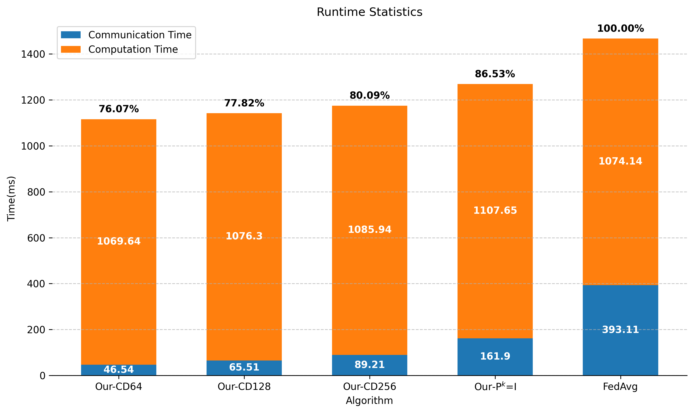
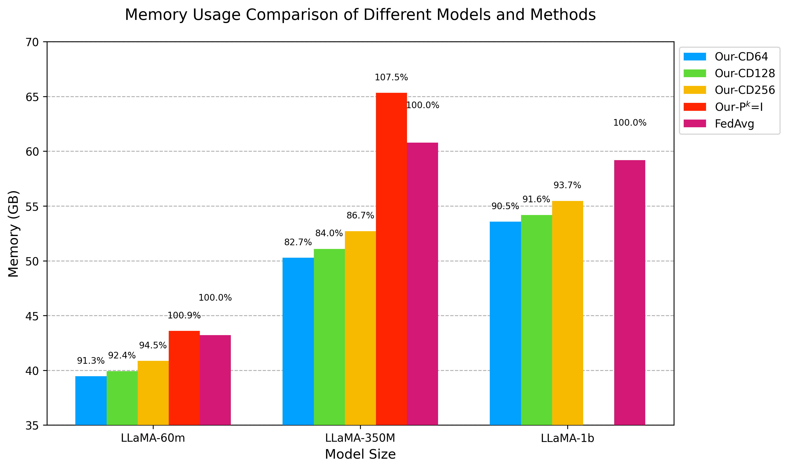

<div align="center">
  <h1>An Efficient Subspace Algorithm for Federated
Learning on Heterogeneous Data</h1>
</div>


* This repository contains the official code for the paper "An Efficient Subspace Algorithm for Federated Learning on Heterogeneous Data". We propose **FedSub**, a subspace-based federated learning (FL) algorithm that addresses two key challenges in large-scale FL:
  - **Efficiency Bottlenecks**: Restricts local client updates to low-dimensional subspaces via projection matrices, significantly reducing communication, computation, and memory costs compared to full-space FL methods (e.g., FedAvg).
  - **Client Drift**: Incorporates low-dimensional dual variables to mitigate performance degradation caused by non-IID (heterogeneous) client data.

* We used the framework from the [pytorch_resnet_cifar10](https://github.com/akamaster/pytorch_resnet_cifar10.git) to set up experiments of our algorithm on ResNet. Many thanks for that.

<div align="center">
  <table>
    <tr>
      <td align="center">
        
        <br>
        <small>Communication Cost (per round)</small>
      </td>
      <td align="center">
        
        <br>
        <small>Memory Usage (LLaMA-1B)</small>
      </td>
    </tr>
  </table>
</div>

### Environment Setup
```bash
conda create -n subscaf python==3.10
conda activate subscaf
pip install -r requirements.txt
```

### Fast Run of Our Algorithm
You can run the following script to carry out a fast run of our algorithm which only use two GPUs to train a llama-60m.
```
bash run.sh
```

### Reproduce Main Experiments in Paper
We summarize the running script of main experiments in our paper in scripts directory. You can run following commands to reproduce the corresponding experiments.
```bash 
bash scripts/llama_pretrain.sh # pretrain llama
bash scripts/llama_finetune.sh # finetune llama
```

### Logging
In our code, we implement serveral methods for you to record the running information and index of our algorithm.

I highly recommend enabling the following parameters to use Weights & Biases (wandb) and tqdm training progress bars.
```bash
--use_wandb
--use_tqdm
```
If you are not convenient, we also support record locally
```bash
--use_log
```
Regardless of the method used to record runtime data, both computational throughput and GPU memory usage will be stored.

### Profiler
To facilitate the statistics of communication time and computation time during runtime, we use the `torch.cuda.Event` function and provide the following two parameters to count the communication time and total runtime during the operation. 
```bash
--measure_comm # record communication time
--measure_all # record training time
```

### Runtime Acceleration
Training large models requires extremely high computational load and memory requirements. Currently, there are many methods available to achieve computational and memory savings, which we have integrated into our code. You can enable them using the following parameters.
```bash
# Note that below two can not use at the same time
--flash_attn
--mixed_precision bf16
```
We have adapted PyTorch's `register_post_accumulate_grad_hook` into our code, which enables real-time parameter updates during backpropagation to save memory. For detailed information, please refer to [PyTorch](https://docs.pytorch.org/tutorials/intermediate/optimizer_step_in_backward_tutorial.html). Use the following parameters to enable this method.
```bash
--per_layer_weight_update
```
Use activation checkpointing technique to save memory further.
```bash 
--ckpt
```

### Adevanced Usage
We have achieved a high degree of abstraction in algorithm design, enabling you to easily apply the Subspace Scaffold algorithm to your model. You can use following code to substitute Linear module of your model to SubScafLinear module.
```python
from utils import replace_with_subscaf_layer
# the aiming linear module you want to substitute
target_modules_list = ["q_proj", "k_proj", "v_proj", "o_proj", "gate_proj", "up_proj", "down_proj"]
# If you need to skip some layers, you can fill in this list. For example, ['0', '1', '2'] can skip the 0th, 1st, and 2nd transformer layers.
jump_modules_list = []
# If you want to substitute conv2d module with SubScafConv2d module in a Resnet model, you should use 'conv2d' in the last argument.
num_subscaf_params, subscaf_params, lbd, comp_mat_rec = replace_with_subscaf_layer(model, target_modules_list, device, args, 
                                                                                    jump_modules_list, 'linear')
```
The code will return the total number of parameters of the replaced modules, the replaced module objects, the $\Lambda$ variables of the algorithm, and the compression matrices used.
Then you can conveniently apply our Subspace Scaffold optimization algorithm to SubScaf modules while using the SGD algorithm for other modules with the following code.
```python
# inclue other module in regular_params
id_subscaf_params = [id(p) for p in subscaf_params]
regular_params = [p for p in model.parameters() if id(p) not in id_subscaf_params]

# for regular_params, set 'is_comp' as False to forbid subspace scaffold algorithm usage
param_groups = [{'params': regular_params, 'is_comp': False}, 
                {'params': subscaf_params, 'is_comp': True, 'lbd': lbd, 'tau': args.tau, 
                  'compression_dim': args.comp_dim}]

# get the optimizer and schedule
optimizer, schedule = get_subscaf_optimizer(args, param_groups, regular_params, subscaf_params, lbd, model)

# update model
loss = model(**batch).loss
loss.backward()
optimizer.step()
schedule.step()
```
We also provide the following variables to facilitate your configuration of the optimizer. Setting them in your script.
```bash
--momentum
--dampening
--weight_decay
--nesterov
```
When training the model with the optimizer obtained from `get_subscaf_optimizer`, the model will only perform internal updates, meaning no communication will occur and the compression matrix will be the same. Use the following method to execute the external update part of Subspace Scaffold.
```python
from utils import outer_update
# Set gene_new_cp will as True to  the compression matrix
# If you use 'svd' method to generate compression matrix, you should fill grad_dict as following
# for p in model.parameters():
#   grad_dict[p] = p.grad
# If you use other method, you can only leave grad_dict as {}
outer_update(model, lbd, comp_mat_rec, target_modules_list, optimizer, 
                subscaf_params, args, device, jump_modules_list, gene_new_cp, grad_dict)
```
Coooool! You has finished the setting of implementing. Then you can see the performance of the Subspace Scaffold algorithm on your model.

